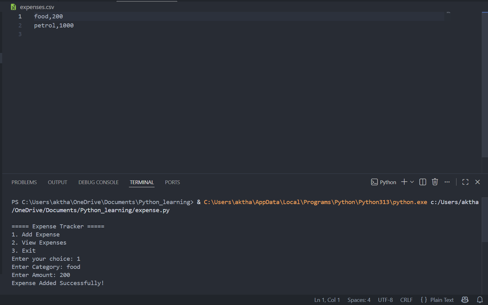

<div align="center">

# Expense Tracker

Track your daily expenses using Python.


</div>

---

## About

Expense Tracker is a simple Python application that helps users record and view daily expenses.

The application stores expense records in a CSV file, making the data persistent even after the program is closed.

---

## Features

- Add new expenses
- View all expenses
- Store data in CSV
- Simple command-line interface
- Lightweight and easy to use

---

## Tech Stack

| Technology | Description |
|------------|-------------|
| Python | Programming Language |
| csv | Store and Read Expense Data |

---

## Project Structure

```text
03-expense-tracker/
│
├── main.py
├── expenses.csv
├── README.md
├── requirements.txt
└── screenshot.png
```

---

## Getting Started

Run the project

```bash
python main.py
```

---

## Sample Output

```text
===== Expense Tracker =====

1. Add Expense
2. View Expenses
3. Exit

Enter your choice: 1

Enter Category:
Food

Enter Amount:
250

Expense Added Successfully!
```

---

## Screenshot

<p align="center">

</p>

---

## Future Improvements

- Edit Expense
- Delete Expense
- Monthly Reports
- Total Expense Calculator
- Category-wise Summary

---

## Author

**Akthar Ahamed**

GitHub: https://github.com/aktharahamed168

LinkedIn: https://www.linkedin.com/in/akthar-ahamed/
