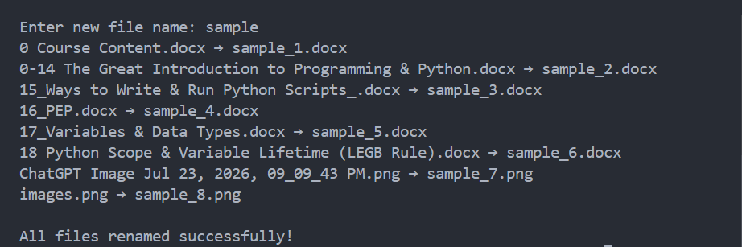

<div align="center">

# Bulk File Renamer

Rename multiple files automatically using Python.


</div>

---

## About

Bulk File Renamer is a Python automation project that renames multiple files in a folder using a custom prefix and sequential numbering.

---

## Features

- Rename multiple files at once
- Keep original file extensions
- Custom filename prefix
- Sequential numbering
- Simple command-line interface

---

## Tech Stack

| Technology | Purpose |
|------------|---------|
| Python | Programming Language |
| os | File operations |

---

## Project Structure

```text
05-bulk-file-renamer/
│
├── main.py
├── README.md
└──requirements.txt
```

---

## Getting Started

```bash
python main.py
```

---

## Sample Output

```text
Enter new file name: Vacation

image1.jpg → Vacation_1.jpg
image2.jpg → Vacation_2.jpg
image3.jpg → Vacation_3.jpg
image4.jpg → Vacation_4.jpg
image5.jpg → Vacation_5.jpg
```

---

## Screenshot

<p align="center">
  Before Rename
  
</p>

<p align="center">
  After Rename
  
</p>

<p align="center">
  Result
  
</p>

## Future Improvements

- Preview changes before renaming
- Undo last rename
- Rename only selected file types
- Add date/time to filenames
- GUI version

---

## Author

**Akthar Ahamed**

GitHub: https://github.com/aktharahamed168

LinkedIn: https://www.linkedin.com/in/akthar-ahamed/
