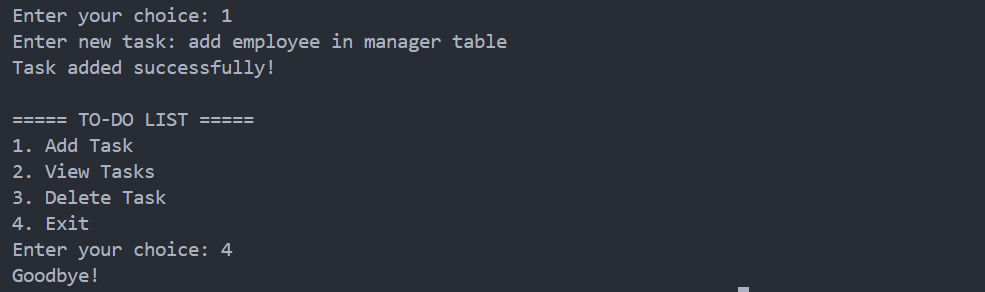

<div align="center">

# To-Do List App

A simple command-line To-Do List application built with Python.


</div>

---

## About

The To-Do List App helps users manage daily tasks using a simple command-line interface. Tasks are stored in a text file, allowing them to persist even after the application is closed.

---

## Features

- Add tasks
- View all tasks
- Delete tasks
- Store tasks in a text file
- Easy to use

---

## Tech Stack

| Technology | Purpose |
|------------|---------|
| Python | Programming Language |
| Text File | Task Storage |

---

## Project Structure

```text
06-to-do-list/
│
├── main.py
├── tasks.txt
├── README.md
├── requirements.txt
└── screenshot.png
```

---

## Getting Started

```bash
python main.py
```

---

## Sample Output

```text
===== TO-DO LIST =====

1. Add Task
2. View Tasks
3. Delete Task
4. Exit
```

---

## Screenshot

<p align="center">
  
</p>

---

## Future Improvements

- Mark tasks as completed
- Edit existing tasks
- Add due dates
- Task priorities
- GUI version

---

## Author

**Akthar Ahamed**

GitHub: https://github.com/aktharahamed168

LinkedIn: https://www.linkedin.com/in/akthar-ahamed/
