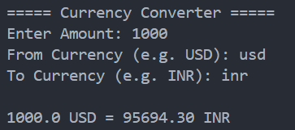

<div align="center">

# Currency Converter

Convert currencies using real-time exchange rates.


</div>

---

## About

Currency Converter is a Python command-line application that converts an amount from one currency to another using real-time exchange rates from a public API.

---

## Features

- Real-time exchange rates
- Supports multiple currencies
- User-friendly interface
- API integration
- Fast and lightweight

---

## Tech Stack

| Technology | Purpose |
|------------|---------|
| Python | Programming Language |
| requests | HTTP Requests |
| ExchangeRate API | Currency Data |

---

## Project Structure

```text
10-currency-converter/
│
├── main.py
├── README.md
├── requirements.txt
└── screenshot.png
```

---

## Getting Started

```bash
pip install -r requirements.txt
python main.py
```

---

## Sample Output

```text
===== Currency Converter =====

Enter Amount: 100
From Currency (e.g. USD): USD
To Currency (e.g. INR): INR

100.0 USD = 8765.20 INR
```

---

## Screenshot

<p align="center">

</p>

---

## Future Improvements

- Convert multiple currencies at once
- Store conversion history
- GUI version
- Favorite currencies
- Currency trend charts

---

## Author

**Akthar Ahamed**

GitHub: https://github.com/aktharahamed168

LinkedIn: https://www.linkedin.com/in/akthar-ahamed/
