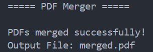

<div align="center">

# PDF Merger

Merge multiple PDF files into a single PDF using Python.


</div>

---

## About

PDF Merger is a Python command-line application that combines multiple PDF documents into a single PDF file using the PyPDF2 library.

---

## Features

- Merge multiple PDFs
- Fast processing
- Lightweight
- Easy to use

---

## Tech Stack

| Technology | Purpose |
|------------|---------|
| Python | Programming Language |
| PyPDF2 | PDF Processing |

---

## Project Structure

```text
13-pdf-merger/
│
├── main.py
├── README.md
├── requirements.txt
├── sample1.pdf
├── sample2.pdf
├── merged.pdf
└── screenshot.png
```

---

## Getting Started

```bash
pip install -r requirements.txt
python main.py
```

---

## Sample Output

```text
===== PDF Merger =====

PDFs merged successfully!
Output File: merged.pdf
```

---

## Screenshot

<p align="center">

</p>

---

## Future Improvements

- Merge unlimited PDFs
- Merge selected pages
- Drag-and-drop support
- GUI version
- Password-protected PDF support

---

## Author

**Akthar Ahamed**

GitHub: https://github.com/aktharahamed168

LinkedIn: https://www.linkedin.com/in/akthar-ahamed/
