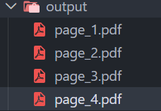

<div align="center">

# PDF Splitter

Split a PDF into individual pages using Python.


</div>

---

## About

PDF Splitter is a Python application that extracts every page from a PDF and saves each page as a separate PDF document.

---

## Features

- Split PDF into individual pages
- Fast processing
- Automatic output folder creation
- Beginner-friendly

---

## Tech Stack

| Technology | Purpose |
|------------|---------|
| Python | Programming Language |
| PyPDF2 | PDF Processing |

---

## Project Structure

```text
14-pdf-splitter/
│
├── main.py
├── README.md
├── requirements.txt
├── sample.pdf
├── output/
└── screenshot.png
```

---

## Getting Started

```bash
pip install -r requirements.txt
python main.py
```

---

## Sample Output

```text
===== PDF Splitter =====

Successfully split 5 pages.
```

---

## Screenshot
<p align="center">

</p>

<p align="center">

</p>

---

## Future Improvements

- Split selected pages
- Split page ranges
- Password-protected PDF support
- GUI version
- Merge selected pages back into a PDF

---

## Author

**Akthar Ahamed**

GitHub: https://github.com/aktharahamed168

LinkedIn: https://www.linkedin.com/in/akthar-ahamed/
