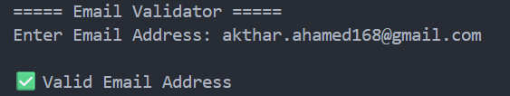

<div align="center">

# Email Validator

Validate email addresses using Regular Expressions (Regex).


</div>

---

## About

Email Validator is a Python command-line application that checks whether an email address follows the standard email format using Regular Expressions (Regex).

---

## Features

- Validate email format
- Regex-based pattern matching
- Fast and lightweight
- Beginner-friendly

---

## Tech Stack

| Technology | Purpose |
|------------|---------|
| Python | Programming Language |
| re | Regular Expressions |

---

## Project Structure

```text
15-email-validator/
│
├── main.py
├── README.md
├── requirements.txt
└── screenshot.png
```

---

## Getting Started

```bash
python main.py
```

---

## Sample Output

```text
===== Email Validator =====

Enter Email Address:
akthar.ahamed168@gmail.com

✅ Valid Email Address
```

---

## Screenshot

<p align="center">

</p>

---

## Future Improvements

- Validate multiple emails from a file
- Detect disposable email providers
- Domain validation
- GUI version
- Export validation results

---

## Author

**Akthar Ahamed**

GitHub: https://github.com/aktharahamed168

LinkedIn: https://www.linkedin.com/in/akthar-ahamed/
