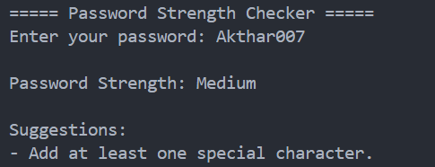

<div align="center">

# Password Strength Checker

Evaluate password strength using validation rules and Regular Expressions.


</div>

---

## About

Password Strength Checker is a Python command-line application that evaluates password strength based on length, uppercase letters, lowercase letters, numbers, and special characters.

The application also provides suggestions for improving weak passwords.

---

## Features

- Check password strength
- Detect uppercase letters
- Detect lowercase letters
- Detect numbers
- Detect special characters
- Provide improvement suggestions

---

## Strength Levels

| Score | Strength |
|:-----:|----------|
| 0–2 | Weak |
| 3–4 | Medium |
| 5 | Strong |

---

## Tech Stack

| Technology | Purpose |
|------------|---------|
| Python | Programming Language |
| re | Regular Expressions |

---

## Project Structure

```text
16-password-strength-checker/
│
├── main.py
├── README.md
├── requirements.txt
└── screenshot.png
```

---

## Getting Started

```bash
python main.py
```

---

## Sample Output

```text
===== Password Strength Checker =====

Enter your password: Hello@1234

Password Strength: Strong

Your password meets all requirements.
```

---

## Screenshot

<p align="center">
  
</p>

---

## Future Improvements

- Password entropy calculation
- Common-password detection
- Password history checking
- GUI version
- Batch password analysis

---

## Author

**Akthar Ahamed**

GitHub: https://github.com/aktharahamed168

LinkedIn: https://www.linkedin.com/in/akthar-ahamed/
