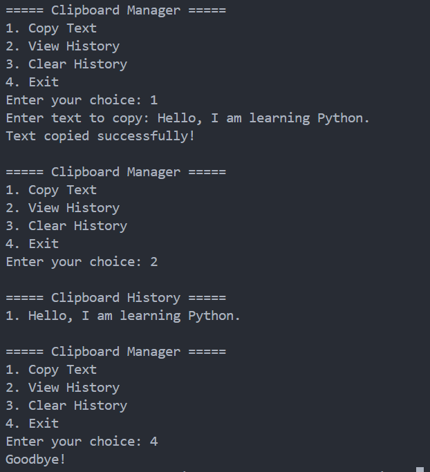

<div align="center">

# Clipboard Manager

Manage copied text using Python.


</div>

---

## About

Clipboard Manager is a Python command-line application that allows users to copy text and maintain a temporary clipboard history.

---

## Features

- Copy text to clipboard
- View clipboard history
- Clear clipboard history
- Simple menu-driven interface
- Lightweight and easy to use

---

## Tech Stack

| Technology | Purpose |
|------------|---------|
| Python | Programming Language |
| Pyperclip | Clipboard Management |

---

## Project Structure

```text
19-clipboard-manager/
│
├── main.py
├── README.md
├── requirements.txt
└── screenshot.png
```

---

## Installation

```bash
pip install -r requirements.txt
```

---

## Usage

```bash
python main.py
```

---

## Sample Output

```text
===== Clipboard Manager =====

1. Copy Text
2. View History
3. Clear History
4. Exit

Enter your choice: 2

===== Clipboard History =====

1. Python
2. SQL
3. Machine Learning
```

---

## Screenshot

<p align="center">
  
</p>

---

## Future Improvements

- Persistent clipboard history
- Search clipboard history
- Delete individual items
- Automatically monitor clipboard changes
- GUI version
- SQLite database storage

---

## Author

**Akthar Ahamed**

GitHub: https://github.com/aktharahamed168

LinkedIn: https://www.linkedin.com/in/akthar-ahamed/
