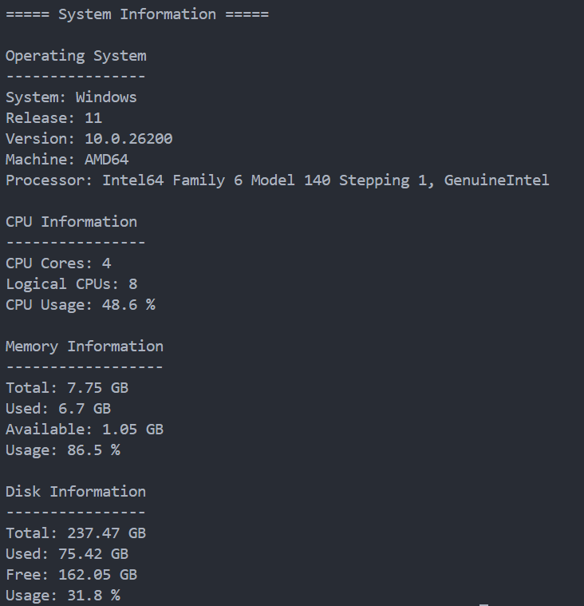

<div align="center">

# System Information

Display basic hardware and operating system information using Python.


</div>

---

## About

System Information is a Python command-line application that displays information about the operating system, CPU, memory, and disk usage.

---

## Features

- Display operating system information
- Display CPU information
- Monitor CPU usage
- Display RAM usage
- Display disk usage
- Simple command-line interface

---

## Tech Stack

| Technology | Purpose |
|------------|---------|
| Python | Programming Language |
| platform | Operating System Information |
| psutil | System Monitoring |

---

## Project Structure

```text
20-system-information/
│
├── main.py
├── README.md
├── requirements.txt
└── screenshot.png
```

---

## Installation

```bash
pip install -r requirements.txt
```

---

## Usage

```bash
python main.py
```

---

## Sample Output

```text
===== System Information =====

Operating System
----------------
System: Windows
Release: 11
Machine: AMD64

CPU Information
----------------
CPU Cores: 6
Logical CPUs: 12
CPU Usage: 18.5 %

Memory Information
------------------
Total: 15.8 GB
Used: 8.2 GB
Available: 7.6 GB
Usage: 52.0 %

Disk Information
----------------
Total: 476.94 GB
Used: 210.45 GB
Free: 266.49 GB
Usage: 44.1 %
```

---

## Screenshot

<p align="center">
  
</p>

---

## Future Improvements

- Live CPU monitoring
- Live RAM monitoring
- Network information
- Battery information
- Running process information
- GUI dashboard
- Export system report

---

## Author

**Akthar Ahamed**

GitHub: https://github.com/aktharahamed168

LinkedIn: https://www.linkedin.com/in/akthar-ahamed/
