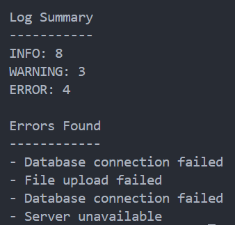

<div align="center">

# Log Analyzer

Analyze application log files and identify important events.


</div>

---

## About

Log Analyzer is a Python command-line application that reads log files, counts different log levels, and identifies error messages.

It demonstrates how Python can be used to process and analyze structured text data.

---

## Features

- Read log files
- Count INFO, WARNING, and ERROR messages
- Extract error messages
- Generate a simple log summary
- Handle structured text data

---

## Tech Stack

| Technology | Purpose |
|------------|---------|
| Python | Programming Language |
| Counter | Count Log Events |
| File Handling | Read Log Files |

---

## Project Structure

```text
21-log-analyzer/
│
├── main.py
├── sample.log
├── README.md
├── requirements.txt
└── screenshot.png
```

---

## Getting Started

```bash
python main.py
```

---

## Sample Output

```text
===== Log Analyzer =====

Log Summary
-----------
INFO: 8
WARNING: 3
ERROR: 4

Errors Found
------------
- Database connection failed
- File upload failed
- Database connection failed
- Server unavailable
```

---

## Screenshot

<p align="center">
  
</p>

---

## Future Improvements

- Analyze multiple log files
- Filter logs by date
- Search specific errors
- Generate CSV reports
- Generate charts
- Real-time log monitoring
- GUI dashboard

---

## Author

**Akthar Ahamed**

GitHub: https://github.com/aktharahamed168

LinkedIn: https://www.linkedin.com/in/akthar-ahamed/
