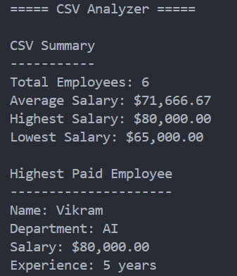

<div align="center">

# CSV Analyzer

Analyze structured CSV data and generate useful statistics using Python.


</div>

---

## About

CSV Analyzer is a Python command-line application that reads structured CSV data and generates useful statistics such as employee count, average salary, highest salary, lowest salary, and highest-paid employee.

---

## Features

- Read CSV files
- Analyze structured data
- Calculate average salary
- Find highest salary
- Find lowest salary
- Identify highest-paid employee

---

## Tech Stack

| Technology | Purpose |
|------------|---------|
| Python | Programming Language |
| csv | CSV File Processing |

---

## Project Structure

```text
22-csv-analyzer/
│
├── main.py
├── sample.csv
├── README.md
├── requirements.txt
└── screenshot.png
```

---

## Getting Started

```bash
python main.py
```

---

## Sample Output

```text
===== CSV Analyzer =====

CSV Summary
-----------
Total Employees: 6
Average Salary: $71,666.67
Highest Salary: $80,000.00
Lowest Salary: $65,000.00

Highest Paid Employee
---------------------
Name: Vikram
Department: AI
Salary: $80,000.00
Experience: 5 years
```

---

## Screenshot

<p align="center">
  
</p>

---

## Future Improvements

- Analyze any CSV file
- Filter data by department
- Generate charts
- Export analysis reports
- Add Pandas support
- Build a GUI dashboard

---

## Author

**Akthar Ahamed**

GitHub: https://github.com/aktharahamed168

LinkedIn: https://www.linkedin.com/in/akthar-ahamed/
