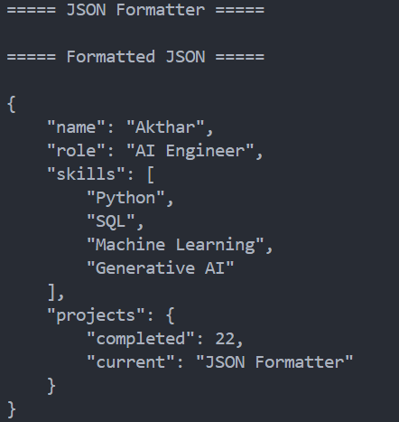

<div align="center">

# JSON Formatter

Format and validate JSON data using Python.


</div>

---

## About

JSON Formatter is a Python command-line application that reads JSON files, formats them with proper indentation, and detects invalid JSON syntax.

---

## Features

- Read JSON files
- Format JSON with indentation
- Validate JSON syntax
- Handle invalid JSON
- Handle missing files
- Simple command-line interface

---

## Tech Stack

| Technology | Purpose |
|------------|---------|
| Python | Programming Language |
| json | JSON Processing |

---

## Project Structure

```text
23-json-formatter/
│
├── main.py
├── sample.json
├── README.md
├── requirements.txt
└── screenshot.png
```

---

## Getting Started

```bash
python main.py
```

---

## Sample Output

```text
===== JSON Formatter =====

===== Formatted JSON =====

{
    "name": "Akthar",
    "role": "AI Engineer",
    "skills": [
        "Python",
        "SQL",
        "Machine Learning",
        "Generative AI"
    ],
    "projects": {
        "completed": 22,
        "current": "JSON Formatter"
    }
}
```

---

## Screenshot

<p align="center">
  
</p>

---

## Future Improvements

- Format user-provided JSON
- Minify JSON
- JSON file conversion
- JSON syntax highlighting
- GUI version
- Validate JSON from API responses

---

## Author

**Akthar Ahamed**

GitHub: https://github.com/aktharahamed168

LinkedIn: https://www.linkedin.com/in/akthar-ahamed/
