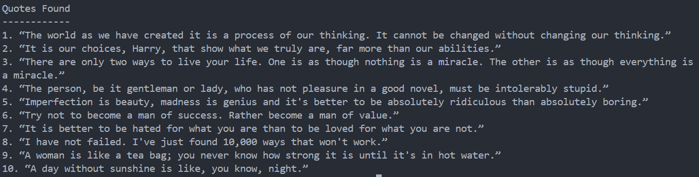

<div align="center">

# Web Scraper

Extract quotes and authors from a webpage using Python.


</div>

---

## About

Web Scraper is a Python command-line application that retrieves webpage content and extracts structured information from HTML.

The project extracts quotes and their authors and saves the results into a CSV file.

---

## Features

- Fetch webpage content
- Parse HTML
- Extract quotes
- Extract authors
- Save results to CSV
- Handle HTTP request failures

---

## Tech Stack

| Technology | Purpose |
|------------|---------|
| Python | Programming Language |
| Requests | HTTP Requests |
| BeautifulSoup | HTML Parsing |
| CSV | Store Scraped Data |

---

## Project Structure

```text
24-web-scraper/
│
├── main.py
├── README.md
├── requirements.txt
└── screenshot.png
```

---

## Installation

```bash
pip install -r requirements.txt
```

---

## Usage

```bash
python main.py
```

---

## Sample Output

```text
===== Web Scraper =====

Quotes Found
------------

1. “The world as we have created it is a process of our thinking...”
   Author: Albert Einstein

2. “It is our choices, Harry, that show what we truly are...”
   Author: J.K. Rowling

Quotes saved to quotes.csv
```

---

## Screenshot

<p align="center">
  
</p>

---

## Future Improvements

- Scrape multiple pages
- Add keyword filtering
- Scrape different websites
- Export to JSON
- Add pagination support
- Build a GUI interface

---

## Author

**Akthar Ahamed**

GitHub: https://github.com/aktharahamed168

LinkedIn: https://www.linkedin.com/in/akthar-ahamed/
