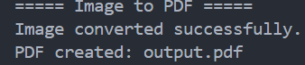

<div align="center">

# Image to PDF Converter

Convert JPG, JPEG, and PNG images into a PDF using Python.


</div>

---

## About

Image to PDF Converter is a Python command-line application that converts images into PDF files.

The project uses Pillow to process the image and generate the PDF.

---

## Features

- Convert images to PDF
- Supports JPG, JPEG, and PNG
- Automatically converts images to RGB
- Simple command-line application
- Lightweight and easy to use

---

## Tech Stack

| Technology | Purpose |
|------------|---------|
| Python | Programming Language |
| Pillow | Image Processing |

---

## Project Structure

```text
25-image-to-pdf/
│
├── main.py
├── requirements.txt
├── README.md
└── screenshot.png
```

---

## Installation

Install the required library:

```bash
pip install -r requirements.txt
```

Or:

```bash
pip install pillow
```

---

## Usage

Update the image path inside `main.py`:

```python
image_path = "C:/Users/aktha/OneDrive/Desktop/Linkedin Stuffs/sample.jpg"
```

Then run:

```bash
python main.py
```

---

## Sample Output

```text
===== Image to PDF =====
Image converted successfully.
PDF created: output.pdf
```

---

## Output

The program generates:

```text
output.pdf
```

The PDF contains the converted image.

---

## Screenshot

<p align="center">
  
</p>

---

## Future Improvements

- Convert multiple images into one PDF
- Select images using user input
- Add a graphical user interface
- Allow custom PDF filenames
- Automatically detect images from a folder

---

## Author

**Akthar Ahamed**

GitHub: https://github.com/aktharahamed168

LinkedIn: https://www.linkedin.com/in/akthar-ahamed/
