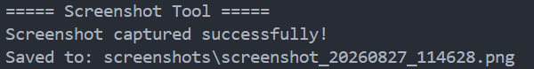

<div align="center">

# Screenshot Tool

Capture the entire screen and automatically save screenshots with a timestamp using Python.


</div>

---

## About

Screenshot Tool is a Python command-line application that captures the current screen and saves the screenshot as a PNG file.

Each screenshot is automatically given a unique timestamp-based filename.

---

## Features

- Capture the entire screen
- Automatically create a screenshots folder
- Save screenshots as PNG
- Generate timestamp-based filenames
- Simple command-line interface

---

## How It Works

```text
Run Program
     ↓
Capture Screen
     ↓
Generate Timestamp
     ↓
Create Filename
     ↓
Save PNG
```

---

## Tech Stack

| Technology | Purpose |
|------------|---------|
| Python | Programming Language |
| PyAutoGUI | Screen Capture |
| datetime | Timestamp Generation |
| os | File and Folder Handling |

---

## Project Structure

```text
27-screenshot-tool/
│
├── .gitignore
├── main.py
├── requirements.txt
├── README.md
└── screenshot.png
```

---

## Installation

Install the required library:

```bash
pip install -r requirements.txt
```

Or:

```bash
pip install pyautogui
```

---

## Usage

Run the program:

```bash
python main.py
```

The screenshot will automatically be saved inside:

```text
screenshots/
```

Example:

```text
screenshots/
└── screenshot_20260827_114000.png
```

---

## Sample Output

```text
===== Screenshot Tool =====
Screenshot captured successfully!
Saved to: screenshots\screenshot_20260827_114000.png
```

---

## Screenshot

<p align="center">
  
</p>

---

## Future Improvements

- Capture a selected region
- Add keyboard shortcuts
- Add screenshot delay
- Add image format selection
- Add GUI interface
- Add automatic screenshot naming options

---

## Author

**Akthar Ahamed**

GitHub: https://github.com/aktharahamed168

LinkedIn: https://www.linkedin.com/in/akthar-ahamed/
