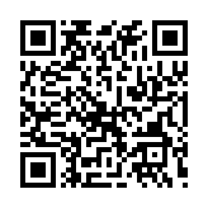

<div align="center">

# Wi-Fi QR Generator

Generate a QR code containing Wi-Fi network details using Python.


</div>

---

## About

Wi-Fi QR Generator is a Python command-line application that creates a QR code containing Wi-Fi network information.

Users can scan the generated QR code with a compatible smartphone to quickly connect to a Wi-Fi network.

---

## Features

- Generate Wi-Fi QR codes
- Support WPA, WEP, and open networks
- Accept Wi-Fi name and password from the user
- Save the QR code as a PNG image
- Simple command-line interface

---

## How It Works

```text
Wi-Fi Name
    +
Password
    +
Security Type
    ↓
Python
    ↓
Wi-Fi QR Data
    ↓
QR Code
    ↓
wifi_qr.png
```

---

## Tech Stack

| Technology | Purpose |
|------------|---------|
| Python | Programming Language |
| qrcode | QR Code Generation |
| Pillow | Image Processing |

---

## Project Structure

```text
28-wifi-qr-generator/
│
├── .gitignore
├── main.py
├── requirements.txt
├── README.md
└── screenshot.png
```

---

## Installation

Install the required library:

```bash
pip install -r requirements.txt
```

Or:

```bash
pip install "qrcode[pil]"
```

---

## Usage

Run the program:

```bash
python main.py
```

Enter the Wi-Fi details when prompted:

```text
===== Wi-Fi QR Generator =====
Enter Wi-Fi name (SSID): Demo_WiFi
Enter Wi-Fi password: DemoPassword123
Enter security type (WPA/WEP/nopass): WPA
```

The program generates:

```text
wifi_qr.png
```

---

## Sample Output

```text
===== Wi-Fi QR Generator =====

Enter Wi-Fi name (SSID): Demo_WiFi
Enter Wi-Fi password: DemoPassword123
Enter security type (WPA/WEP/nopass): WPA

QR code generated successfully!
Saved as: wifi_qr.png
```

---

## Security Note

The generated QR code contains the Wi-Fi password.

For this project, use **dummy Wi-Fi credentials** when creating screenshots or sharing the project publicly.

Do not upload a QR code containing your real Wi-Fi password to GitHub.

---

## Screenshot
<p align="center">
  
</p>
<p align="center">
  
</p>

---

## Future Improvements

- Add a graphical user interface
- Add custom QR code styling
- Allow custom output filenames
- Support multiple Wi-Fi profiles
- Add QR code preview
- Add encryption/security validation

---

## Author

**Akthar Ahamed**

GitHub: https://github.com/aktharahamed168

LinkedIn: https://www.linkedin.com/in/akthar-ahamed/
